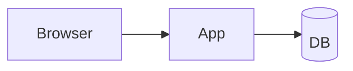
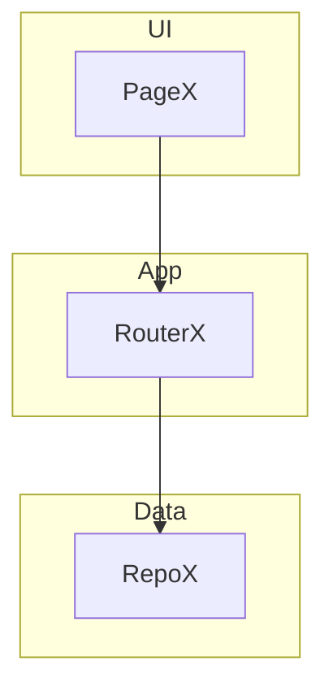
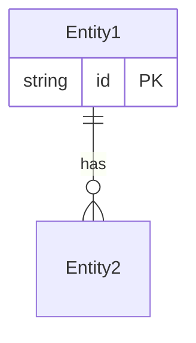
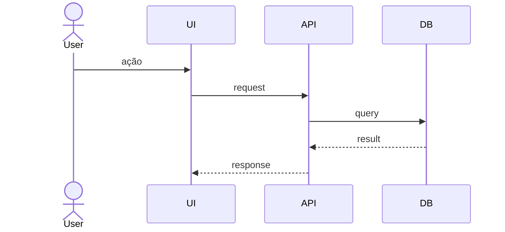

# ARCH_MAP — Mapa Arquitetural do Projeto

> Gerado/atualizado por `/vd-arch-review`. Documento vivo: roda de novo
> após mudanças grandes, atualiza incremental.
>
> **Skill:** `vd-arch-review` (3ª skill da família VibeDev, user-invoked)
> **Versão da skill:** 1.0.0
> **Última atualização:** AAAA-MM-DD

---

## Resumo executivo

**Veredito atual:** OK / REVISAR / BLOQUEAR
**Total de achados:** X (🔴 R / 🟡 A / 🔵 N)
**Próxima ação:** [1 frase concreta]

---

## Nível 1 — Macro (Stack & Topologia)

### Linguagens
- [linguagem + versão]

### Frameworks
- Web: [...]
- Backend: [...]
- ORM: [...]
- Test: [...]

### Banco de dados
- [driver + versão]

### Infra
- Container: [Dockerfile/compose?]
- Deploy: [Vercel/Railway/AWS?]
- CI: [GitHub Actions?]

### Dependências externas (diret)
- Total: X deps
- Top 5: [...]

### Estrutura de pastas (top 3)
```
src/
  app/
  components/
  ...
```

### Diagrama de containers



[Detalhe completo em `.arch-review/macro-stack.md`]

---

## Nível 2 — Meso (Arquitetura & Fluxo)

### Módulos identificados
- `src/server/X/` — [responsabilidade]
- `src/app/Y/` — [responsabilidade]

### Diagrama de Componentes



### Modelo de dados (resumo)



### Fluxo crítico 1: [Nome]



[Detalhe completo em `.arch-review/meso-arch.md`]

---

## Nível 3 — Micro (Saúde & Débito)

### Resumo por categoria

| Categoria | 🔴 | 🟡 | 🔵 |
|---|---|---|---|
| Camadas | 0 | 1 | 0 |
| Anti-patterns | 1 | 2 | 1 |
| Acoplamento | 0 | 1 | 0 |
| Abstração | 0 | 1 | 0 |
| Dep vs Custom | 0 | 1 | 1 |
| Teste | 1 | 0 | 2 |
| Docs | 0 | 0 | 1 |

### Lista priorizada (top 5)

1. [severidade] **Título** — categoria · `path/file.ts:linha` · 🟢/🟡/🔴 esforço
2. ...

### Achados completos

[Lista em `.arch-review/micro-health.md`]

---

## Histórico de auditorias

| Data | Comando | Níveis | Veredito | Achados (🔴/🟡/🔵) |
|---|---|---|---|---|
| AAAA-MM-DD | /vd-arch-full | 1+2+3 | BLOQUEAR | 2/6/5 |

---

## Como atualizar

- Rodar `/vd-arch-full` regera tudo
- Rodar `/vd-arch-only` atualiza só nível 2
- Rodar `/vd-arch-health` atualiza só nível 3
- Idempotente: rodar de novo não duplica, atualiza data

## Quem pode ler isto

- Dev que chega no projeto — onboarding
- CTO/lead técnico — decisão de modernização
- AI assistant — contexto arquitetural antes de mexer

## O que NÃO está aqui

- Análise de segurança (use VibeShield `audit` ou `code-review`)
- Performance profiling (não é análise estática)
- Cobertura de teste real (use o test runner)
- Pentest (`.out-of-scope/not-an-arch-audit-tool.md`)

---

**Versão da skill que gerou:** 1.0.0
**Mantido por:** 4pixeltechBR
**Inspirado em:** mattpocock/skills `improve-codebase-architecture` (referência competitiva) e arXiv:2607.00038 (5-level verification ladder, Sandeco Macedo)
