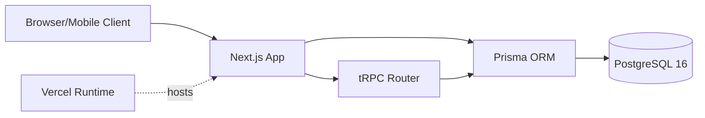

# Nível 1 — Macro (Stack & Topologia)

> Inventário de superfície. Resposta rápida: "que linguagens, que frameworks,
> que banco, que infra". Não analisa qualidade — só **lista**.

## Comando

`/vd-arch-full` (executa nível 1 + 2 + 3) ou parte do escopo maior.

## Categorias de varredura

### Linguagens e runtimes

```bash
# Detectar linguagens
find . -type f \( -name "*.ts" -o -name "*.js" -o -name "*.py" -o -name "*.go" \
  -o -name "*.rs" -o -name "*.java" -o -name "*.rb" -o -name "*.php" \) \
  -not -path "*/node_modules/*" -not -path "*/.git/*" -not -path "*/venv/*" \
  | head -20

# Detectar versão
cat package.json | jq '.engines'
cat .python-version 2>/dev/null
cat go.mod | head -5
```

### Package manager

```bash
# Identificar
ls package-lock.json yarn.lock pnpm-lock.yaml 2>/dev/null
ls Pipfile.lock poetry.lock requirements.txt 2>/dev/null
ls go.sum 2>/dev/null
ls Cargo.lock 2>/dev/null
```

### Frameworks principais

```bash
# Web
grep -E '"(next|nuxt|remix|astro|svelte|vue|react|angular)"' package.json

# Backend
grep -E '"(express|fastify|koa|hapi|django|flask|fastapi|gin|echo|rails|sinatra)"' package.json

# ORM
grep -E '"(prisma|typeorm|sequelize|drizzle|sqlalchemy|django-orm|gorm)"' package.json

# Test
grep -E '"(jest|vitest|mocha|pytest|go-test|cargo-test)"' package.json
```

### Banco de dados

```bash
# Driver / client
grep -E '"(pg|mysql2|sqlite3|mongoose|prisma|@prisma/client|drizzle-orm|psycopg|asyncpg)"' package.json
grep -E '"(psycopg2|sqlalchemy|django|gorm|sqlx)"' requirements.txt

# Migrations
ls prisma/migrations 2>/dev/null
ls db/migrate 2>/dev/null
ls migrations 2>/dev/null
```

### Infra e deploy

```bash
# Container
ls Dockerfile docker-compose.yml docker-compose.yaml 2>/dev/null
ls .dockerignore 2>/dev/null

# Orquestração
ls k8s/ kubernetes/ helm/ 2>/dev/null

# Serverless
ls serverless.yml netlify.toml vercel.json fly.toml railway.json 2>/dev/null

# CI
ls .github/workflows .gitlab-ci.yml .circleci 2>/dev/null
```

### Dependências externas (diret)

```bash
# Top 10 deps diretas
cat package.json | jq '.dependencies, .devDependencies' | head -50

# Tamanho
du -sh node_modules 2>/dev/null
du -sh vendor 2>/dev/null
```

### Estrutura de pastas (top 3 níveis)

```bash
find . -maxdepth 3 -type d -not -path "*/node_modules*" -not -path "*/.git*" \
  -not -path "*/venv*" -not -path "*/__pycache__*" | sort
```

## Saída esperada (formato)

```markdown
## Macro — Stack & Topologia

### Linguagens
- TypeScript 5.4 (Node 20+)
- Python 3.11 (parcial, scripts)

### Frameworks
- Web: Next.js 14 (App Router)
- API: tRPC + Zod
- ORM: Prisma 5
- Test: Vitest + Playwright

### Banco de dados
- PostgreSQL 16 (driver: pg + Prisma)
- Migrations em `prisma/migrations/`

### Infra
- Dockerfile + docker-compose (dev)
- Vercel (deploy de produção)
- GitHub Actions (CI em `.github/workflows/`)

### Dependências externas (diret)
Total: 47 deps produção + 38 devDependencies
Top 5: next@14.2.5, react@18.3.1, @prisma/client@5.15.0, zod@3.23.8, trpc@11.0.0

### Estrutura de pastas (top 3)
```
src/
  app/         (Next.js App Router)
  components/
  server/      (tRPC routers)
  lib/
  prisma/
prisma/
public/
```

### Diagrama Mermaid de containers



## Achados do nível 1 (raros — só listagem)

Se aparecer, geralmente é:
- Linguagem mista sem justificativa (ex: TS e Python no mesmo serviço sem razão)
- Dependência gigante sem uso (ex: lodash inteiro pra usar 1 função)
- Sem lockfile (deps não-fixadas)
- Sem CI configurado

## Persistência

Salvar em `.arch-review/macro-stack.md` e referenciar no `ARCH_MAP.md`.
