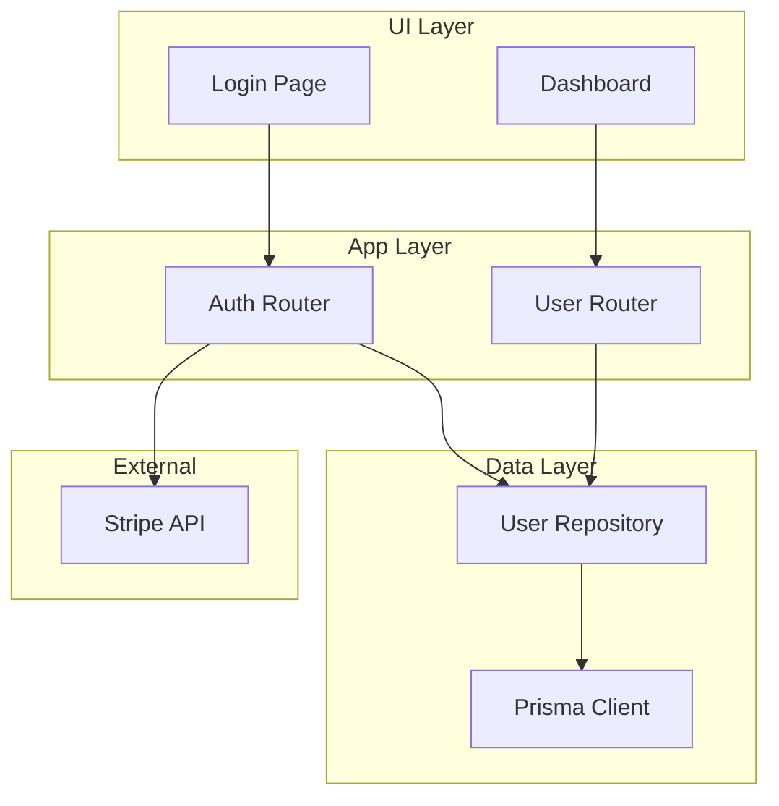
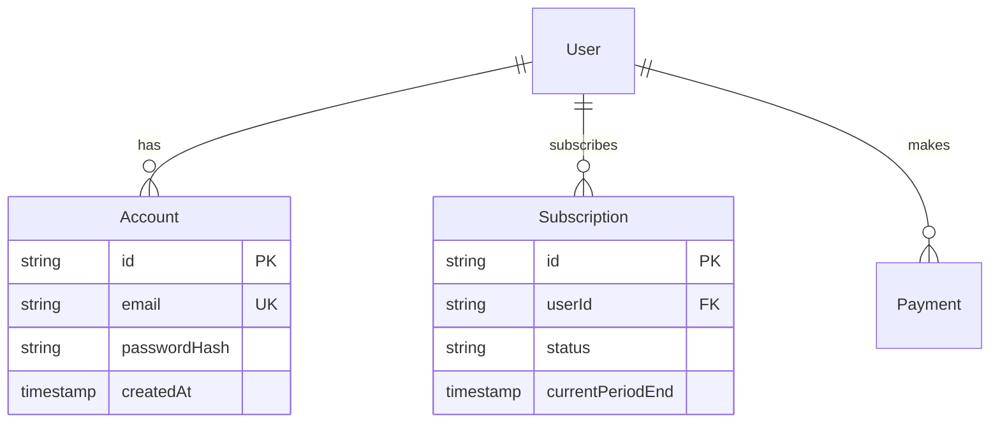
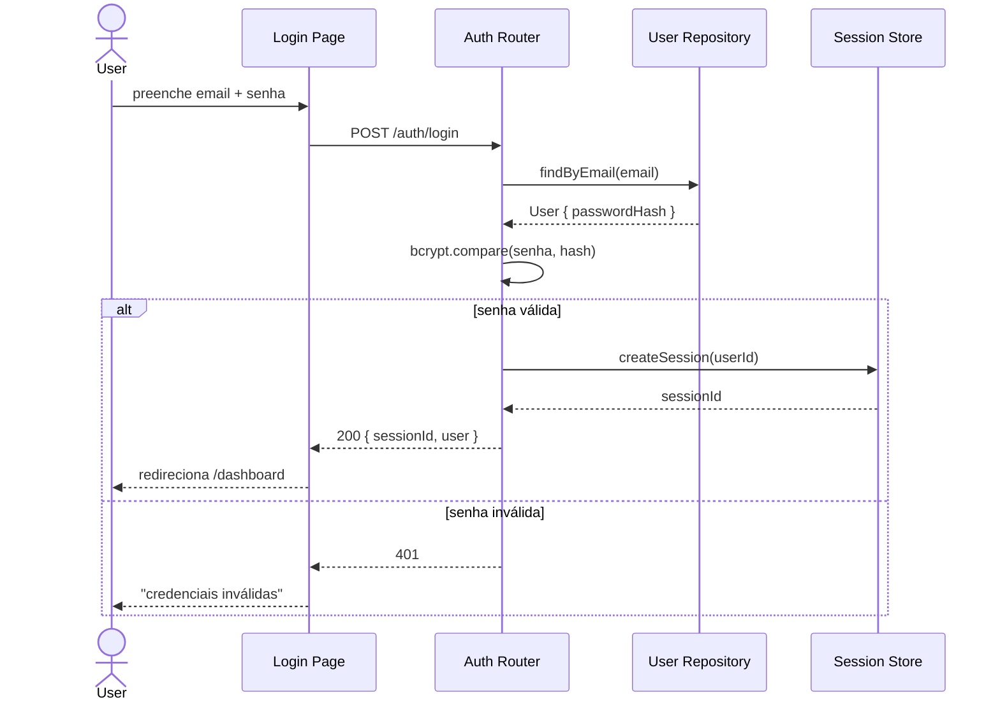

# Nível 2 — Meso (Arquitetura & Fluxo de Dados)

> Como o código se organiza. Resposta: "quem chama quem, onde estão as
> fronteiras, qual o caminho de uma request". Foco em **módulos, bounded
> contexts, modelo de dados, fluxos críticos**.

## Comando

`/vd-arch-only` (só nível 2) ou parte do `/vd-arch-full`.

## Vocabulário (de mattpocock/skills `codebase-design`)

Antes de auditar, carregue este vocabulário — vai ser usado nos achados:

- **Módulo** — qualquer coisa com interface e implementação (função, classe, package, slice entre camadas). Escala-agnóstico.
- **Interface** — tudo que um caller precisa saber: assinatura + invariantes + ordering + error modes + config + performance.
- **Implementação** — corpo do módulo, distinto de Adapter.
- **Adapter** — coisa concreta que satisfaz interface numa seam.
- **Seam** — lugar onde você pode mudar comportamento sem editar ali. Onde fica a interface.
- **Deep module** — muito comportamento por pouca interface (bom).
- **Shallow module** — interface quase tão complexa quanto implementação (ruim).
- **Leverage** — quanto callers ganham de profundidade.
- **Locality** — quanto maintainers ganham (mudança fica concentrada).

> **Evite:** "componente", "service", "API", "boundary" (overloaded com DDD).

## Categorias de varredura

### Módulos e bounded contexts

```bash
# Procurar por estrutura modular
ls src/modules 2>/dev/null
ls src/features 2>/dev/null
ls src/domains 2>/dev/null
ls src/contexts 2>/dev/null
ls app/(.*) 2>/dev/null   # Next.js App Router com rotas agrupadas

# Tamanho dos arquivos (top 10)
find . -name "*.ts" -not -path "*/node_modules/*" -not -path "*/.next/*" \
  | xargs wc -l 2>/dev/null | sort -rn | head -11
```

### Imports e dependências entre módulos

```bash
# Quem importa o quê
grep -rn "^import" src/ | head -30

# Imports cíclicos (heurística: arquivos que importam uns aos outros)
# Rodar com `madge` se disponível: npx madge --circular src/

# Fan-out de um arquivo (quantos outros ele importa)
for f in $(find src -name "*.ts" | head -20); do
  count=$(grep -c "^import" "$f" 2>/dev/null || echo 0)
  echo "$count $f"
done | sort -rn
```

### Modelo de dados

```bash
# Schema do ORM
cat prisma/schema.prisma 2>/dev/null | head -50
cat src/entities/*.ts 2>/dev/null | head -50
cat app/models/*.py 2>/dev/null | head -50

# SQL direto (de migrations)
ls db/migrate db/migrations prisma/migrations 2>/dev/null
cat db/migrate/*.sql 2>/dev/null | head -50
```

### Rotas de API

```bash
# Next.js App Router
find app -name "route.ts" -o -name "route.tsx" 2>/dev/null

# Express / Fastify / etc
grep -rn "app\.\(get\|post\|put\|delete\|patch\)" src/ 2>/dev/null

# tRPC
find src/server -name "*.ts" -not -name "index.ts" 2>/dev/null

# GraphQL
find . -name "schema.graphql" -o -name "*.gql" 2>/dev/null
```

### Fluxos críticos

Lista de fluxos que o dev declara (ou que a skill infere):

1. **Autenticação** (signup, login, logout, recover)
2. **Pagamento** (checkout, refund, cancel)
3. **Core do produto** (a "1 coisa que o app faz")
4. **Notificações** (envio de e-mail, push, etc)
5. **Admin** (painel interno)

## Saída esperada (formato)

```markdown
## Meso — Arquitetura & Fluxo

### Módulos identificados
- `src/server/auth/` — autenticação (modulinho, ~200 linhas)
- `src/server/payments/` — Stripe integration
- `src/server/users/` — perfil + settings
- `src/app/(public)/` — landing, login
- `src/app/(app)/` — dashboard, settings

### Diagrama de Componentes (Mermaid)



### Modelo de dados (resumo)



### Fluxo crítico 1: Login (diagrama de sequência)



### Achados do nível 2 (comuns)

- **Camadas vazadas:** UI chamando ORM direto, controller com SQL inline
- **Bounded context quebrado:** `auth/` chamando `payments/` direto (em vez de evento / fila)
- **God module:** `users/index.ts` com 2000 linhas e 30 exports
- **Shallow adapter:** interface tão complexa quanto a implementação
- **Fluxos críticos sem diagrama:** dev não consegue explicar login em 30s

## Persistência

Salvar em `.arch-review/meso-arch.md` e referenciar no `ARCH_MAP.md`.
